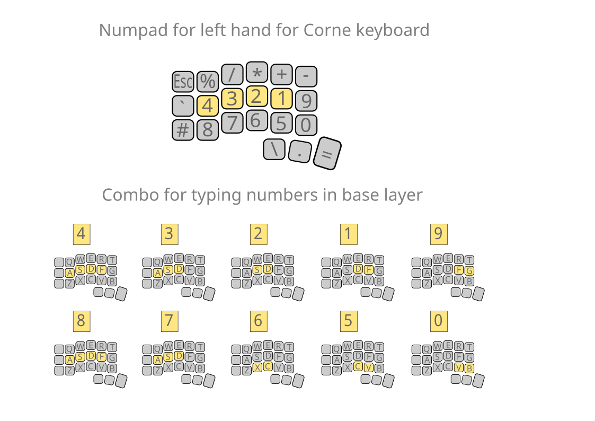

# Corne Keyboard Layout in Vial for Programming

## Description

This layout is designed for the Corne keyboard and saved in Vial format. It is optimized for comfortable work with source code in various IDEs.

## Installation

1. Make sure your keyboard supports Vial.
2. Download the layout file and upload it to Vial.
3. Customize the keys as you wish.

## Features of the Layout

- Convenient access to most symbols and navigation from the base layer.
- Numpad for numbers and other symbols.
- Useful navigation layer.
- Convenient access to all F-keys.
- Mouse navigation.

## Screenshots

### Numpad Layer and Number Combos on Base Layer

### Symbols and Navigation on Base Layer

## License

This project is licensed under the MIT License.

