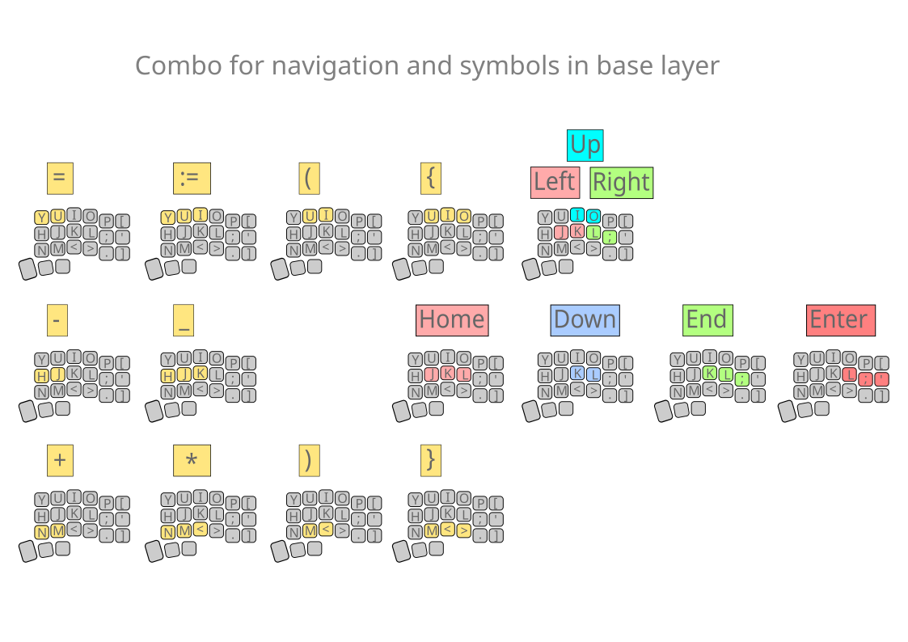

# Corne Keyboard Layout in Vial for Programming

## Description

This layout is designed for the Corne keyboard and is saved in Vial format. It is optimized for comfortable work with source code in various IDEs.

## Installation

1. Ensure that your keyboard supports Vial.
2. Download the layout file and upload it to Vial.

## Features of the Layout

- Convenient access to most symbols and navigation from the base layer.
- Numpad for numbers and arithmetic operators allows for calculations in the Calc application using just your left hand.
- Useful navigation layers enable operation with just your right hand.
- Convenient access to all F-keys when pressing Ctrl, Alt, Shift, or Gui.
- Mouse navigation support.

## Screenshots

### Numpad Layer and Number Combos on Base Layer

### Symbols and Navigation on Base Layer

### Navigation and F-keys Layers

## License

This project is licensed under the MIT License.

